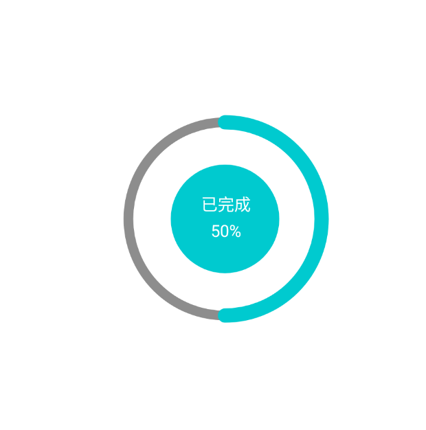

# RingCircleView
圆圈进度值显示；  
带有百分比；  
带有状态文字；  
# 预览

# 资源
|名字|资源|
|-|-|
|AAR|[ring_circle_view.aar](https://github.com/RelinRan/RingCircleView/blob/master/ring_circle_view.aar)|
|GitHub |[RingCircleView](https://github.com/RelinRan/RingCircleView)|
|Gitee|[RingCircleView](https://gitee.com/relin/RingCircleView)|
# Maven
1.build.grade | setting.grade
```
repositories {
	...
	maven { url 'https://jitpack.io' }
}
```
2./app/build.grade
```
dependencies {
	implementation 'com.github.RelinRan:ClipView:2022.7.18.1'
}
```
# xml
~~~
<androidx.widget.RingCircleView
   android:id="@+id/ring"
   android:layout_width="match_parent"
   android:layout_height="match_parent"/>
~~~
# attrs.xml
~~~
<!--圆圈背景宽度-->
<attr name="ringBackgroundStrokeWidth" format="dimension" />
<!--圆圈背景宽度-->
<attr name="ringProgressStrokeWidth" format="dimension" />
<!--圆圈背景颜色-->
<attr name="ringBackgroundColor" format="color" />
<!--圆圈进度颜色-->
<attr name="ringProgressColor" format="color" />
<!--圆圈和圆的间距-->
<attr name="circleRingSpace" format="dimension" />
<!--圆圈背景宽度-->
<attr name="circleRadius" format="dimension" />
<!--圆圈背景颜色-->
<attr name="circleBackgroundColor" format="color" />
<!--圆圈文字颜色-->
<attr name="circleTextColor" format="color" />
<!--圆圈文字大小-->
<attr name="circleTextSize" format="dimension" />
<!--圆圈文字间距-->
<attr name="circleTextSpace" format="dimension" />
<!--进度值-->
<attr name="progress" format="integer" />
<!--最大值-->
<attr name="max" format="integer" />
<!--文字-->
<attr name="text" format="string" />
~~~
# 使用
~~~
RingCircleView ring = findViewById(R.id.ring);
ring.setMax(100);
ring.setProgress(50);
~~~
